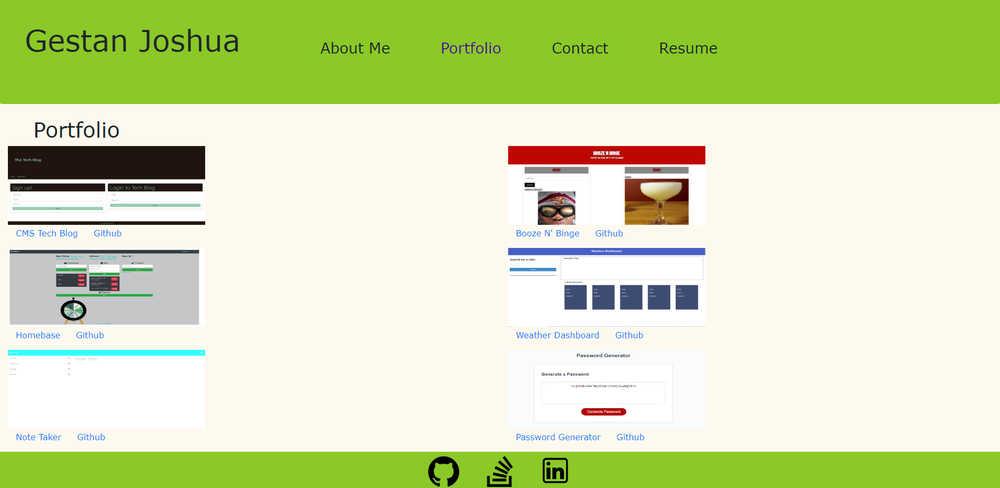

# React Portfolio

## Purpose

To showcase who I am and my talent to potential employers in technical manner!

## Built With

* JS

* REACT

* CSS/Bootstrap

* NODE

## Usage

When an employer reaches this single-page application, they'll be given a opportunity to see who I am, some back ground information about me, my technical skillset, can download my resume, and fill out some basic information for me to reach out to them.

## Credits

Sam Varney (clasmate) helped me rid of bugs and figure out useState logic.

## Example

## Link to Website

https://634a523daa66ac64e3f79982--kaleidoscopic-yeot-353c2e.netlify.app/